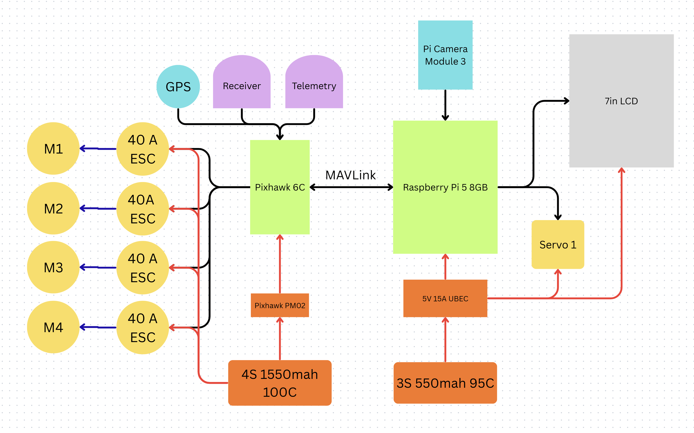
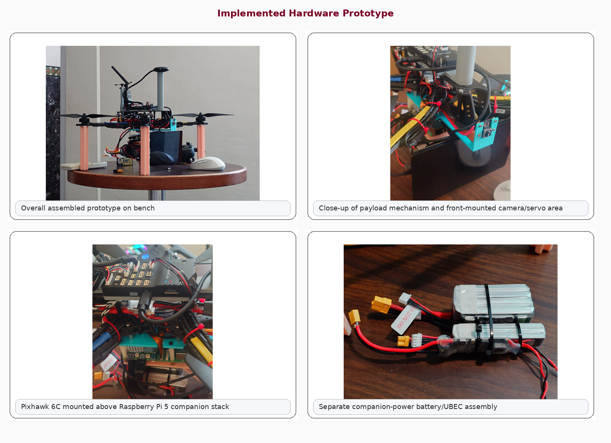
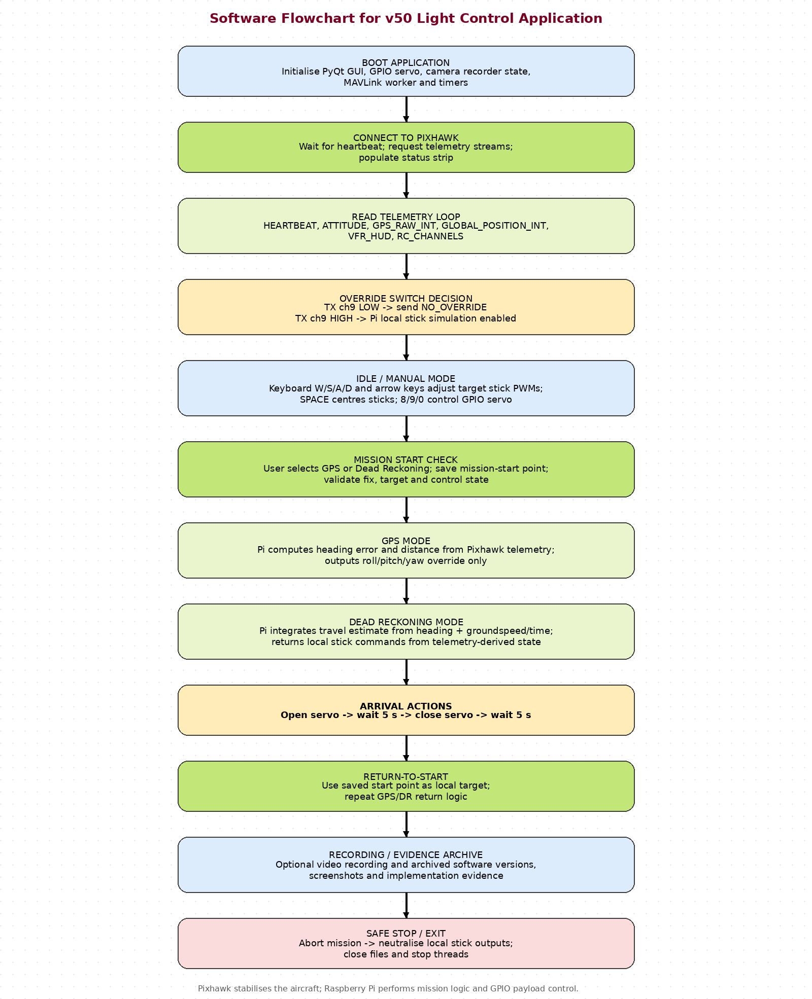
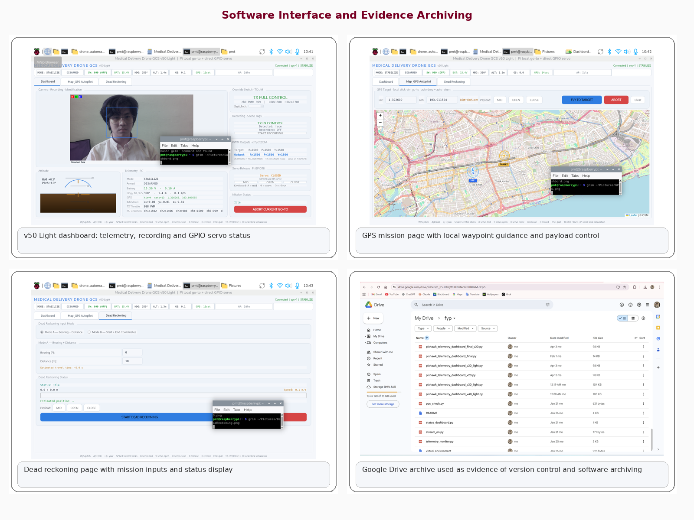

# Technical Documentation — Medical Delivery Drone for Critical Supply Transport

> Repository documentation for the implemented quadrotor prototype, its wiring logic, power architecture, and software structure.

## 1. Document purpose
This document explains how the implemented medical-delivery drone prototype is built, how the main hardware subsystems are connected, and how the companion-computer software is organised. It is intended for GitHub documentation and engineering handover rather than for flight-operation approval.

The implemented baseline documented here is the prototype described in the final report: a **quadrotor** built around a **Pixhawk 6C** flight controller and a **Raspberry Pi 5 (8 GB)** companion computer. The system uses a **split-power architecture** so that propulsion loads and companion-computer loads do not share the same electrical rail.

---

## 2. System summary
The drone is organised into three main layers:

1. **Propulsion layer**  
   Generates lift and thrust using four motors, four ESCs, and a 4S propulsion battery.

2. **Flight-control layer**  
   Uses Pixhawk 6C as the stabilisation and sensor-integration core.

3. **Companion-computing layer**  
   Uses Raspberry Pi 5 for GUI, telemetry display, mission logic, payload handling, recording, and software-side state management.

The design objective is to demonstrate a practical medical-delivery architecture that is realistic to build, bench-validate, document, and extend.

---

## 3. Hardware architecture
### 3.1 Block diagram


### 3.2 Main hardware used
#### Flight-control hardware
- Holybro **Pixhawk 6C**
- GNSS/GPS module connected to Pixhawk
- ELRS receiver connected to Pixhawk
- Telemetry radio connected to Pixhawk

#### Propulsion hardware
- **4 × 2807 1300 KV brushless motors**
- **4 × Hobbywing XRotor 40 A ESCs**
- **Gemfan 9045 propellers**
- **4S 1550 mAh 100C LiPo** (main propulsion battery)
- **Holybro PM02** power module

#### Companion-computing hardware
- **Raspberry Pi 5 (8 GB)**
- **Pi Camera Module 3**
- **7-inch front LCD**
- Payload release servo
- **3S 550 mAh 95C LiPo** (companion battery)
- **5 V / 15 A UBEC**

---

## 4. How the main parts are connected
### 4.1 Propulsion-side connections
- The **4S propulsion battery** feeds the propulsion rail.
- The propulsion rail powers all **4 ESCs**.
- Each ESC drives **one motor**.
- The **PM02** also draws from the propulsion side and feeds the Pixhawk power path while providing voltage/current sensing.

### 4.2 Flight-controller connections
- **GPS / GNSS module → Pixhawk GPS port**
- **ELRS receiver → Pixhawk RC input path**
- **Telemetry radio → Pixhawk telemetry port**
- **Pixhawk USB → Raspberry Pi USB** for MAVLink communication

### 4.3 Companion-computing connections
- **3S companion battery → 5 V / 15 A UBEC**
- **UBEC 5 V output → Raspberry Pi 5**
- **UBEC 5 V output → 7-inch LCD**
- **UBEC 5 V output → payload servo**
- **Pi Camera Module 3 → Raspberry Pi camera interface**
- **Raspberry Pi ↔ Pixhawk → USB MAVLink link**

### 4.4 Payload mechanism
The payload system is implemented as a **servo-actuated release mechanism**. In the documented v50 baseline, the servo is controlled from the Raspberry Pi side as part of mission-state logic. At destination, the software executes a timed release sequence, then begins return-to-start logic.

---

## 5. Power architecture
### 5.1 Why split power is used
A major engineering feature of the prototype is the use of **separate electrical power domains**.

#### Propulsion domain
- Battery: **4S 1550 mAh 100C**
- Powers: motors, ESCs, PM02, Pixhawk flight-controller path

#### Companion domain
- Battery: **3S 550 mAh 95C**
- Feeds: **5 V / 15 A UBEC**
- Powers: Raspberry Pi 5, LCD, servo, Pi-side electronics

### 5.2 Engineering reason
This separation reduces the chance that propulsion-side current spikes, ESC noise, or battery sag propagate into the Raspberry Pi rail. In practice, this lowers the risk of Pi undervoltage events or resets during throttle transients and makes the system more modular for troubleshooting.

---

## 6. Physical build arrangement
### 6.1 Prototype evidence


### 6.2 Layout summary
- **Top / airframe layer**: quad arms, motors, propellers, GPS mast
- **Middle avionics layer**: Pixhawk 6C, receiver, telemetry, PM02 wiring
- **Lower companion-computing layer**: Raspberry Pi 5, LCD path, camera path, servo path
- **Battery arrangement**: separate propulsion and companion batteries mounted independently

This arrangement improves serviceability because propulsion, flight-control, and Pi-side subsystems can be inspected and modified with less coupling.

---

## 7. Propulsion system summary
### 7.1 Propulsion configuration
- **Motor**: 2807 1300 KV
- **Propeller**: Gemfan 9045
- **ESC**: Hobbywing XRotor 40 A
- **Battery**: 4S 1550 mAh 100C

### 7.2 Practical interpretation
This propulsion combination was selected to provide:
- useful lift margin
- practical throttle response
- conservative ESC sizing relative to the current operating envelope
- compact packaging for the implemented quadrotor frame

### 7.3 Reported operating point
The current implementation was reported to hover at approximately **40% throttle**, which suggests that the aircraft is not operating near thrust saturation in steady hover.

---

## 8. Software architecture
### 8.1 v50 Light flowchart


### 8.2 Control philosophy
The Raspberry Pi is treated as a **companion computer**, not as the primary flight controller.

- The Pi does **not** replace Pixhawk stabilisation.
- The Pi reads telemetry over **MAVLink**.
- The Pi runs the **GUI**, mission-state logic, recording, and payload logic.
- Pixhawk remains responsible for low-level flight stability and sensor-handling responsibilities.

### 8.3 Main software modules
- MAVLink communication worker
- PyQt dashboard
- GPS mission page
- Dead-reckoning page
- Manual local-stick / keyboard logic
- Payload release state machine
- Return-to-start logic
- Recording and evidence archive support

---

## 9. Interface and evidence archive


This image set shows the delivered interface and the archived software directory used as evidence of iterative development.

---

## 10. Repository software variants
The repository may contain multiple mission-control variants. The versioning logic should be documented clearly in each file/folder. The three project variants can be described as:

### Version 1 — simplest version
- Manual takeoff
- Mission started from GUI after takeoff
- Manual landing

### Version 2 — fully automated Raspberry Pi version
- GUI starts mission
- Automatic takeoff
- Automatic mission execution
- Automatic landing

### Version 3 — altitude-gated mission start version
- Mission prepared in GUI first
- Manual takeoff
- Mission begins automatically after reaching **4 m altitude**
- Manual landing

---

## 11. Setup note for repository users
Before running the software, users should update the Pixhawk serial device path in the Python file. For example:

```python
PORT = "/dev/serial/by-id/usb-Holybro_Pixhawk6C_xxxxxxxxxxxxxxxxx-if00"
```

To find the correct serial ID on the Raspberry Pi:

```bash
ls /dev/serial/by-id/
```

---

## 12. Safety note
This project documentation describes an academic prototype. Any real testing must be carried out with appropriate safety controls, regulatory awareness, and bench-testing discipline. Software bring-up and wiring validation should always be performed with propellers removed.
